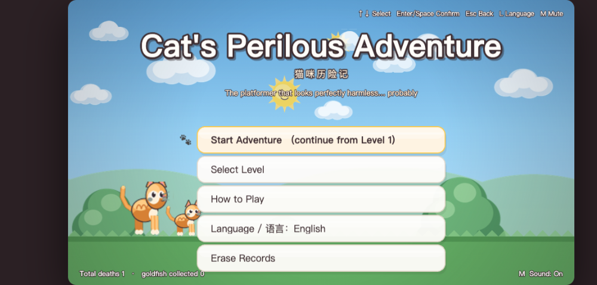
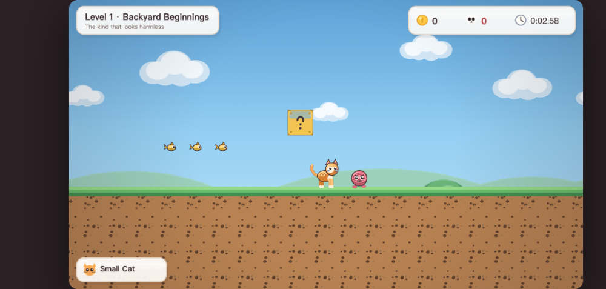
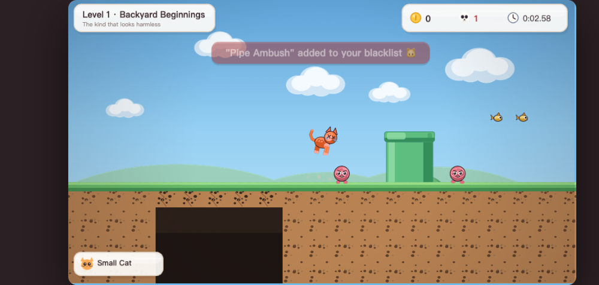

English | [简体中文](./README.zh-CN.md)

# Cat's Perilous Adventure

An **original** "trap-troll platformer" — a tribute to the Cat Mario / Syobon Action school of "looks perfectly harmless, is actually booby-trapped everywhere", except the hero is a cat, and **all art, level layouts and sound effects are original designs**.

> **A note on originality**
> This project is not a pixel-for-pixel or level-for-level copy of any copyrighted game.
> Not a single sprite, level coordinate, or frame of music comes from another game.
> What it borrows is the **trap-troll platformer** genre itself.
> Every asset is drawn in code by `tools/gen_assets.py` (Pillow, 4× supersampled then downsampled),
> and every sound effect is synthesized in real time by `src/utils/audio.js` with Web Audio — the project ships **zero audio files**.

---

## Screenshots

All screenshots below were captured from the **English** build of the game
(`node tools/shot.mjs` shoots both languages automatically; the Chinese README uses the Chinese set).

### Main menu



A perfectly innocent title screen — except the bottom-left corner keeps an honest tally of your total deaths.

### Level 1 · Backyard Beginnings



Clean grass, goldfish, question blocks, and a leisurely yarn-ball enemy — all of it a decoy.

### Pipe section · The ambush



Just got trolled by a yarn ball popping out of a pipe; the death counter ticks up one,
and the system thoughtfully adds it to your personal blacklist.

---

## 1. Requirements

| Item | Requirement |
| --- | --- |
| OS | macOS (Windows / Linux work too; only the packaging scripts are configured for mac) |
| Node.js | **>= 18** (developed on 22.x) |
| Python | **>= 3.9** (only needed to regenerate art assets, not to play) |
| Browser | Any modern browser (Chrome / Safari / Edge) |

The game itself is **pure static files** with no backend dependency, and runs **fully offline** once packaged.

---

## 2. Quick start

```bash
npm install          # install deps and copy Phaser into vendor/ automatically (for offline use)
npm run dev          # start a local static server
```

Then open **http://localhost:5173/** in your browser.

> ⚠️ **Do not double-click `index.html`.**
> The game uses ES Modules; browsers refuse to load modules over `file://` for security reasons,
> so opening the file directly gives you a blank page (the page shows a hint too). Just use `npm run dev`.

### Package as a macOS app

```bash
npm run electron     # run the desktop version locally (to preview it)
npm run build:mac    # produce .dmg / .zip into dist/
```

`electron/main.cjs` starts an in-process static server bound to `127.0.0.1` before opening the page —
this works around the `file://` ES Module restriction and also guarantees offline play.

---

## 3. Language / 语言

The game ships **bilingual UI (English & 简体中文)** — every menu, HUD label, toast and taunt is translated:

- The language is picked automatically on first launch (from your browser language), English is the fallback default.
- Switch any time from the **main menu**: `Language / 语言: …` row, or just press **`L`**.
- Your choice is remembered (`localStorage`).
- You can also force a language via URL: `http://localhost:5173/?lang=en` or `?lang=zh`
  (handy for sharing links and for `tools/shot.mjs`, which captures both sets of screenshots).

All strings live in one dictionary: `src/utils/i18n.js`. Adding a third language means adding one more block there.

---

## 4. Controls

| Key | Action |
| --- | --- |
| `←` / `A` | Move left |
| `→` / `D` | Move right |
| `Space` / `↑` / `W` | Jump (**hold to jump higher, tap for a lower hop**) |
| `↓` / `S` | Crouch / slide (**only the big cat can crouch**, squeezing through low passages) |
| `Shift` | Run (speed 200 → 310, and jumps a bit higher too) |
| `P` / `Esc` | Pause |
| `R` | **Restart the level instantly** (the death rate is high, so the retry loop is as fast as possible — no cutscenes) |
| `L` | Switch language English / 中文 |
| `M` | Mute / unmute |

In menus: `↑↓` to select, `Enter` / `Space` to confirm, `Esc` to go back.

---

## 5. Gameplay rules

**Game feel (these are what make it "tight, not janky" — all implemented)**

- Constant gravity + a terminal fall velocity cap (prevents tunneling through terrain at high speed)
- **Coyote time**: you can still jump within ~100ms after walking off a ledge
- **Jump buffering**: a jump pressed ~100ms before landing is remembered and fired automatically
- **Variable jump height**: releasing the jump key cuts upward velocity immediately
- **Juice**: squash & stretch on jump/land, dust particles, camera shake — purely cosmetic, the hitboxes never change

**Form state machine**

```
Small cat --eat fish can--> Big cat --take a hit--> Small cat --hit again--> Death
                Eat a star → blink + any enemy touched is instantly crushed
```

- Stomp an enemy from above = kill + a small bounce (hold jump to bounce higher)
- Touch an enemy from the side / below = take a hit; a small cat dies, a big cat shrinks back to small
- Hit `?` blocks for items; **the big cat can smash plain brick blocks, the small cat can't** (classic rules)
- On death the level **restarts in place automatically** — no lives are consumed, only the "death count" goes up

**Results screen**

Clearing a level shows your time, the goldfish you collected, and — displayed biggest of all — **your death count**.
It is the badge of honor of this genre, and the flavor text gets meaner the more you died
(0 deaths: "Did you peek at the script beforehand?"; 80+: "This isn't a clear anymore, it's performance art").

Best time / fewest deaths are stored in `localStorage` (key `catmario.save.v1`).

---

## 6. Levels & traps

Three levels, each 200–220 tiles wide (about 10 screens), each packing **7 kinds** of traps.

| Level | Size | Theme | Trap density |
| --- | --- | --- | --- |
| Level 1 · Backyard Beginnings | 200 × 16 | Tutorial-ish: few pits, but every trap type shows up once | 7 kinds |
| Level 2 · Rooftops & Pipes | 210 × 16 | More platforms, pits start appearing in combos | 7 kinds |
| Level 3 · The Sun's Spite | 220 × 16 | Dense traps, chain combos, signature gags maxed out | 7 kinds |

The seven trap types (**all reusable components** — tweak the `TRAP` parameters in `src/utils/constants.js` and it takes effect across every level):

1. **Invisible blocks** — fully transparent; they only materialize when you bump into them
2. **Disguised sky droppers** — clouds / the sun float overhead pretending to be scenery, then drop the moment you walk right beneath them
3. **Fake item, real trap** — the `?` block spawns not a mushroom, but a snapping mushroom monster
4. **Pipe ambushers** — get close to a pipe mouth and a yarn ball pops out instantly (reaction window: tiny)
5. **Vanishing floor** — collapses 0.3s after you step on it, **its texture pixel-identical to real grass**
6. **The goal flag's "fake clear" trap** — first pretends you've won, then pulls the floor out from under you
7. **Misleading ledge + hidden downward conveyor** — looks exactly like a stone block, quietly sinks while you stand on it

For what each level plants and on which tile, see **[docs/关卡陷阱设计说明.md](docs/关卡陷阱设计说明.md)** (in Chinese).

---

## 7. Project structure

```
cat-mario/
├── index.html                 # entry point (loads vendor/phaser.min.js + src/main.js)
├── package.json
├── electron/main.cjs          # Electron main process (embedded static server)
├── vendor/phaser.min.js       # offline Phaser (synced automatically by postinstall)
├── src/
│   ├── main.js                # Phaser config
│   ├── scenes/                # Boot / Preload / Menu / Level / Pause / LevelComplete / GameOver
│   ├── entities/
│   │   ├── Cat.js             # the hero: game feel + form state machine
│   │   ├── Enemy.js           # 4 original enemies
│   │   └── Trap.js            # 7 trap components
│   ├── ui/Hud.js              # rounded-card HUD
│   ├── levels/level{1,2,3}.json   # levels written as ASCII art
│   └── utils/
│       ├── constants.js       # the single source of truth for every magic number
│       ├── i18n.js            # bilingual dictionary (EN / 简体中文) + language picker
│       ├── levelLoader.js     # level parser (pure data, no Phaser dependency)
│       ├── animations.js
│       ├── audio.js           # Web Audio real-time SFX + chiptune music
│       └── save.js            # localStorage saves
├── assets/                    # everything generated by script
│   ├── sprites/ tiles/ ui/
│   └── preview/               # art style sample + game screenshots
│       ├── en/                # screenshots with the English UI (used by README.md)
│       └── zh/                # screenshots with the Chinese UI (used by README.zh-CN.md)
├── tools/
│   ├── gen_assets.py          # art asset generator (Pillow)
│   ├── build_levels.py        # level generator (Python DSL)
│   ├── validate-levels.mjs    # level validator
│   ├── trap-report.mjs        # trap list generator
│   ├── smoke-test.html        # headless smoke test (65 items)
│   ├── run-smoke.mjs          # test driver
│   └── shot.mjs               # game screenshot tool (EN + ZH sets)
└── scripts/
    ├── serve.cjs              # zero-dependency static server
    └── sync-phaser.cjs
```

---

## 8. Common commands

| Command | What it does |
| --- | --- |
| `npm run dev` | Start the local server (http://localhost:5173) |
| `npm run validate` | Validate all three levels: legal characters, ≥3 trap kinds, exactly one goal flag, ground under the spawn point… |
| `npm run smoke` | Run 65 smoke tests in a headless browser (**requires `npm run dev` first**) |
| `npm run traps` | Print / generate the trap list for each level |
| `npm run gen:levels` | Regenerate `src/levels/*.json` |
| `npm run gen:assets` | Regenerate all art assets (needs Python + Pillow) |
| `node tools/shot.mjs` | Capture screenshots (both `en/` and `zh/` sets; `--lang`, `--only` supported) |
| `npm run electron` | Run the Electron desktop version locally |
| `npm run build:mac` | Package the macOS `.dmg` / `.zip` |

`npm run smoke` really boots the game, drives the main loop, and asserts item by item:
asset loading, scene transitions, walk/run speed clamping, variable jump height, coyote time,
stomping vs. side-colliding with enemies, the form state machine, all 7 trap types, death & restart, real vs. fake flag, pause menu…
Currently **65/65 passing, 0 errors**.

---

## 9. How to edit levels / add traps

Levels are **ASCII art** — open `src/levels/level1.json` and it reads itself:

```
Line 12: ###############################   #######################*****####...
                                        ↑ three spaces = a pit    ↑ five * = crumble floor disguised as grass
```

Character meanings live in the `LEGEND` of `src/utils/constants.js`:

| Char | Meaning | Char | Meaning |
| --- | --- | --- | --- |
| `#` / `%` | surface grass / underground dirt | `c` | goldfish |
| `S` / `B` | stone block / brick | `s` / `m` | invincibility star / fish can |
| `P` | pipe | `1` / `2` / `3` / `4` | yarn ball / crow / jumping fish / mushroom monster |
| `?` / `!` | real ? block / fake-item block | `A` | pipe-ambush marker (placed right above the pipe mouth) |
| `H` | invisible block | `v` / `o` | disguised cloud / disguised sun |
| `*` | crumble floor | `.` | harmless cloud (pure decoy) |
| `>` | hidden downward conveyor | `F` / `f` | fake flag / real flag |

The lazier route is generating levels with the DSL in `tools/build_levels.py`:

```python
L.crumble_bridge(57, 61)     # a "crumble floor bridge" across a pit
L.invisible(146, 10)         # an invisible block stuck in your jump path
L.evil_sun(142, 2)           # a sun disguised as background
L.fake_goal(163)             # the fake goal flag
```

After editing, run `npm run gen:levels && npm run validate`.
To tune "how evil a trap is", change the `TRAP` parameters in `src/utils/constants.js` (takes effect across all levels) —
don't hardcode values inside individual levels.

To change or extend **UI text** (any language), edit the dictionary in `src/utils/i18n.js` —
interface strings are never hardcoded in scenes.

---

## 10. A trade-off around `pixelArt`

The design doc suggested enabling `pixelArt: true`. This project deliberately **doesn't**, and the reason is written in `src/utils/constants.js`:

The assets are generated with Pillow **4× supersampled, then LANCZOS-downsampled**, so their edges are anti-aliased smooth lines —
not 16×16 NES mosaic. If the GPU then sampled and scaled them with NEAREST, jaggies and shimmer would appear instead. So:

```js
export const PIXEL_ART = false;   // anti-aliased "HD pixel-style" assets must use linear sampling
```

This is a deliberate deviation, not an oversight. If you swap in true low-resolution pixel art, just flip it back to `true`.

---

## 11. Known limitations

- Currently a **single-player local game** — no online play, no leaderboards.
- Sound is synthesized in real time; timbre varies slightly across browsers / system volume settings.
- `npm run build:mac` needs internet on first run to download the Electron binary; later builds work offline.
- Only 3 levels for now. Adding one is easy via section 9 — feel free to keep planting traps 🐱
