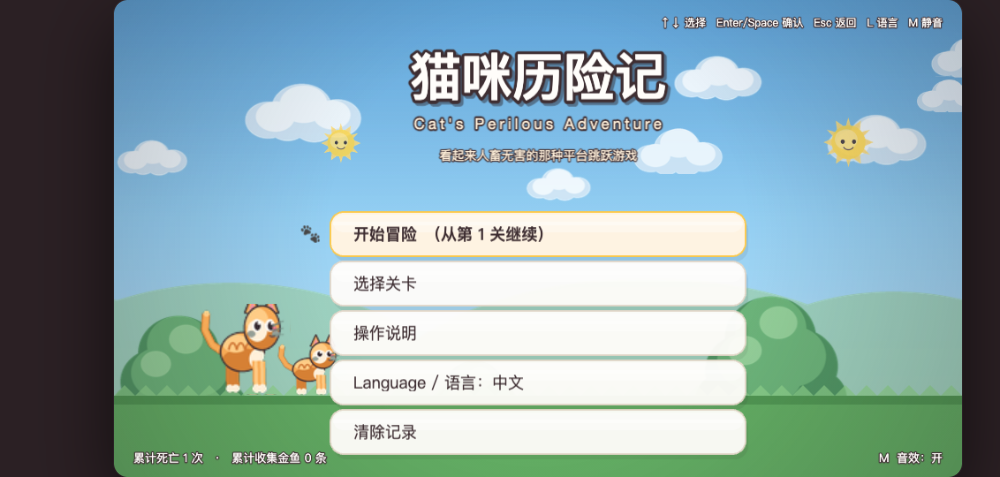
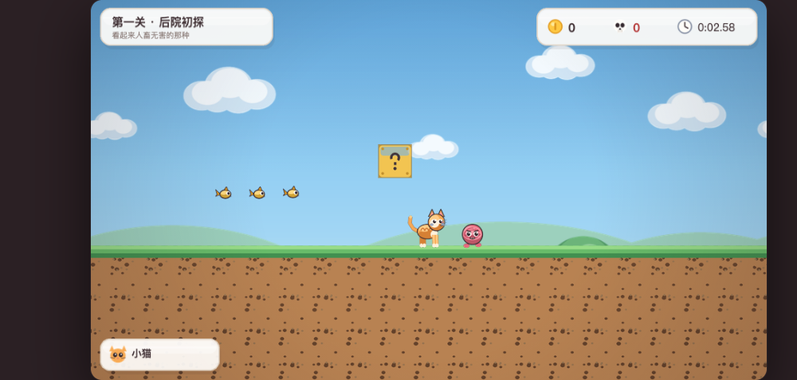
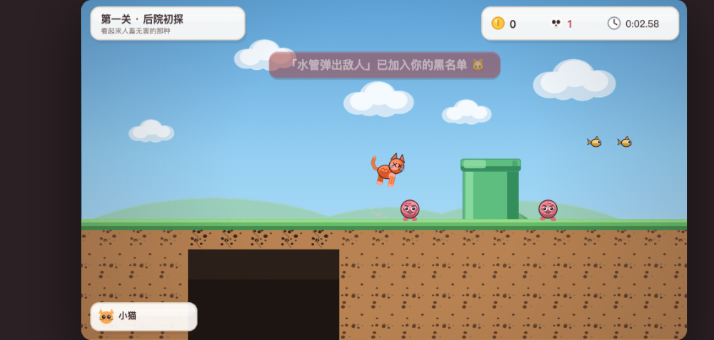

[English](./README.md) | 简体中文

# 猫咪历险记 · Cat's Perilous Adventure

一款**原创**的"陷阱式恶搞平台跳跃"游戏 —— 致敬 Cat Mario / Syobon Action 这一类"看起来人畜无害、实际上满地是坑"的玩法，但主角换成了一只猫，**所有美术、关卡布局、音效全部为原创设计**。

> **原创性声明**
> 本项目不是对任何具体版权作品的逐像素 / 逐关卡复制。
> 没有任何一张精灵图、一段关卡坐标、一帧音乐波形来自其它游戏。
> 借用的只是"陷阱式恶搞平台跳跃"这一**类型玩法**本身。
> 全部素材由 `tools/gen_assets.py` 用代码画出来（Pillow，4 倍超采样后降采样），
> 全部音效由 `src/utils/audio.js` 用 Web Audio 实时合成 —— 项目里**一个音频文件都没有**。

---

## 游戏画面

下面的截图全部来自**中文界面**的游戏实机画面
（`node tools/shot.mjs` 会自动截取中英两套；英文 README 使用英文那套）。

### 主菜单



看起来人畜无害的标题画面，左下角却如实记录着你的累计死亡次数。

### 第一关 · 后院初探



干净的草地、金鱼、问号砖，还有一只慢悠悠的毛线球怪 —— 全是障眼法。

### 水管区 · 伏兵登场



刚被水管里弹出来的毛线球阴死一次，右上角死亡数 +1，
系统还贴心地把它记进了你的"黑名单"。

---

## 1. 环境要求

| 项目 | 要求 |
| --- | --- |
| 操作系统 | macOS（Windows / Linux 也能跑，只是打包脚本按 mac 配置） |
| Node.js | **>= 18**（开发时使用 22.x） |
| Python | **>= 3.9**（只有"重新生成美术素材"时才需要，玩游戏不需要） |
| 浏览器 | 任意现代浏览器（Chrome / Safari / Edge） |

游戏本体是**纯静态文件**，不依赖任何后端服务，打包后**完全离线可玩**。

---

## 2. 快速开始

```bash
npm install          # 安装依赖，并自动把 Phaser 复制到 vendor/（离线用）
npm run dev          # 启动本地静态服务器
```

然后在浏览器打开 **http://localhost:5173/**

> ⚠️ **不要直接双击 `index.html`。**
> 游戏用的是 ES Module，浏览器出于安全策略不允许 `file://` 协议加载模块，
> 直接打开会白屏。页面上也做了提示。用 `npm run dev` 就好。

### 打包成 macOS 应用

```bash
npm run electron     # 本地直接跑桌面版（先看效果）
npm run build:mac    # 产出 .dmg / .zip 到 dist/
```

`electron/main.cjs` 会在进程内起一个只监听 `127.0.0.1` 的静态服务器再打开页面 ——
这是为了绕开 `file://` 不能加载 ES Module 的限制，同时也保证了断网可用。

---

## 3. 语言 / Language

游戏内置**中英双语界面** —— 菜单、HUD、提示语、死亡调侃全部做了翻译：

- 首次进入会按浏览器语言自动选择（中文浏览器默认中文，其它默认英文）；
- 随时可以在**主菜单**里切换：`Language / 语言` 那一行，或者直接按 **`L`** 键；
- 选择会记进存档（`localStorage`），下次启动保持不变；
- 也可以用 URL 参数强制指定：`http://localhost:5173/?lang=zh` 或 `?lang=en`
  （方便分享链接；`tools/shot.mjs` 截图工具也是靠它截出中英两套图的）。

全部文案集中在 `src/utils/i18n.js` 一个字典里。想加第三种语言，在那里加一个语言块即可。

---

## 4. 操作方式

| 按键 | 作用 |
| --- | --- |
| `←` / `A` | 向左移动 |
| `→` / `D` | 向右移动 |
| `空格` / `↑` / `W` | 跳跃（**按住跳更高，轻点跳更低**） |
| `↓` / `S` | 蹲下 / 滑行（**只有大猫能蹲**，可以钻低矮通道） |
| `Shift` | 奔跑（速度 200 → 310，跳得也更高一点） |
| `P` / `Esc` | 暂停 |
| `R` | **立刻重开本关**（死亡率高，所以重试循环做到最快，没有多余过场） |
| `L` | 切换中 / 英界面 |
| `M` | 静音 / 取消静音 |

菜单里用 `↑↓` 选择、`Enter` / `空格` 确认、`Esc` 返回。

---

## 5. 玩法规则

**手感（这几条是"跟手不别扭"的关键，都实现了）**

- 恒定重力 + 最大下落速度上限（防止高速穿透地形）
- **土狼时间**：离开平台边缘后 ~100ms 内仍然可以起跳
- **跳跃缓冲**：落地前 ~100ms 按下的跳跃会被记住并自动补发
- **可变跳跃高度**：松开跳跃键立刻截断上升速度
- **动作反馈**：跳跃 / 落地的挤压拉伸、落地尘土、镜头震动 —— 纯视觉演出，不改变任何碰撞判定

**形态状态机**

```
小猫(small) --吃鱼罐头--> 大猫(big) --受伤--> 小猫 --再受伤--> 死亡
                吃无敌星 → 闪烁 + 撞到任何敌人直接秒杀
```

- 踩敌人头顶 = 消灭 + 小幅弹跳（按住跳跃键弹得更高）
- 从侧面 / 下方碰到敌人 = 受伤；小猫受伤即死，大猫受伤退化成小猫
- 顶 `?` 砖块出道具；**大猫能顶碎普通砖块，小猫顶不碎**（经典规则）
- 死亡后**自动原地重开本关**，不消耗生命，只累计"死亡次数"

**结算**

过关时会显示用时、收集到的金鱼数，以及**放得最大的死亡次数** ——
这是这类游戏的"荣誉勋章"，文案会随着死亡次数越来越损
（0 次是"你是不是提前看过剧本"，80 次以上是"这已经不是通关，这是行为艺术"）。

最佳用时 / 最少死亡次数存在 `localStorage`（键名 `catmario.save.v1`）。

---

## 6. 关卡与陷阱

三关，每关 200–220 格宽（约 10 个屏幕），每关都埋了 **7 种**陷阱。

| 关卡 | 尺寸 | 主题 | 陷阱密度 |
| --- | --- | --- | --- |
| 第一关 · 后院初探 | 200 × 16 | 教学向：坑少，但每类陷阱都露面一次 | 7 种 |
| 第二关 · 屋顶与水管 | 210 × 16 | 平台变多，坑开始组合出现 | 7 种 |
| 第三关 · 太阳的恶意 | 220 × 16 | 陷阱密集、连环组合，签名笑点拉满 | 7 种 |

七类陷阱（**全部是可复用组件**，改 `src/utils/constants.js` 里的 `TRAP` 参数即可全关卡生效）：

1. **隐形砖块** —— 完全透明，撞上去才现形
2. **伪装天空掉落物** —— 云 / 太阳平时飘在天上装装饰，走到正下方才砸下来
3. **假道具真陷阱** —— 顶 `?` 砖出来的不是蘑菇，是会扑咬的蘑菇怪
4. **突然弹出的水管敌人** —— 靠近管口，毛线球立刻弹出（反应时间极短）
5. **地板消失陷阱** —— 踩上 0.3 秒后塌，**贴图和真草地像素级一致**
6. **终点旗杆的"假通关"陷阱** —— 先假装过关，再抽掉地板
7. **视觉误导的高台 + 隐藏向下传送带** —— 外观和石块完全一致，站上去悄悄下沉

每一关埋了什么、埋在哪一格，见 **[docs/关卡陷阱设计说明.md](docs/关卡陷阱设计说明.md)**。

---

## 7. 项目结构

```
cat-mario/
├── index.html                 # 入口（加载 vendor/phaser.min.js + src/main.js）
├── package.json
├── electron/main.cjs          # Electron 主进程（内嵌静态服务器）
├── vendor/phaser.min.js       # 离线用的 Phaser（由 postinstall 自动同步）
├── src/
│   ├── main.js                # Phaser 配置
│   ├── scenes/                # Boot / Preload / Menu / Level / Pause / LevelComplete / GameOver
│   ├── entities/
│   │   ├── Cat.js             # 主角：手感 + 形态状态机
│   │   ├── Enemy.js           # 4 种原创敌人
│   │   └── Trap.js            # 7 类陷阱组件
│   ├── ui/Hud.js              # 圆角卡片式 HUD
│   ├── levels/level{1,2,3}.json   # ASCII 字符画写的关卡
│   └── utils/
│       ├── constants.js       # 所有魔法数字的唯一来源
│       ├── i18n.js            # 中英双语字典 + 语言选择逻辑
│       ├── levelLoader.js     # 关卡解析（纯数据、不依赖 Phaser）
│       ├── animations.js
│       ├── audio.js           # Web Audio 实时合成音效 + 芯片音乐
│       └── save.js            # localStorage 存档
├── assets/                    # 全部由脚本生成
│   ├── sprites/ tiles/ ui/
│   └── preview/               # 《美术风格小样》+ 游戏截图
│       ├── en/                # 英文界面的截图（README.md 使用）
│       └── zh/                # 中文界面的截图（README.zh-CN.md 使用）
├── tools/
│   ├── gen_assets.py          # 美术素材生成器（Pillow）
│   ├── build_levels.py        # 关卡生成器（Python DSL）
│   ├── validate-levels.mjs    # 关卡校验
│   ├── trap-report.mjs        # 生成陷阱清单
│   ├── smoke-test.html        # 无头冒烟测试（65 项）
│   ├── run-smoke.mjs          # 测试驱动器
│   └── shot.mjs               # 游戏截图（支持中英两套）
└── scripts/
    ├── serve.cjs              # 零依赖静态服务器
    └── sync-phaser.cjs
```

---

## 8. 常用命令

| 命令 | 说明 |
| --- | --- |
| `npm run dev` | 启动本地服务器（http://localhost:5173） |
| `npm run validate` | 校验三关：字符合法、陷阱种类 ≥3、旗杆唯一、出生点有地面…… |
| `npm run smoke` | 无头浏览器跑 65 项冒烟测试（**需要先 `npm run dev`**） |
| `npm run traps` | 打印/生成每关的陷阱清单 |
| `npm run gen:levels` | 重新生成 `src/levels/*.json` |
| `npm run gen:assets` | 重新生成全部美术素材（需要 Python + Pillow） |
| `node tools/shot.mjs` | 截取游戏截图（`en/`、`zh/` 两套；支持 `--lang`、`--only`） |
| `npm run electron` | 本地跑 Electron 桌面版 |
| `npm run build:mac` | 打包 macOS `.dmg` / `.zip` |

`npm run smoke` 会真的把游戏跑起来、驱动主循环、逐项断言：
资源加载、场景切换、走跑速度钳制、可变跳跃高度、土狼时间、
踩敌人 / 侧面撞敌人、形态状态机、7 类陷阱、死亡重开、真假旗杆、暂停菜单……
当前 **65/65 全绿，0 报错**。

---

## 9. 怎么改关卡 / 加陷阱

关卡是**ASCII 字符画**，直接在 `src/levels/level1.json` 里改就能看懂：

```
第 12 行：###############################   #######################*****####...
                                 ↑ 三个空格 = 一个坑        ↑ 五个 * = 伪装成草地的碎裂地板
```

字符含义见 `src/utils/constants.js` 的 `LEGEND`：

| 字符 | 含义 | 字符 | 含义 |
| --- | --- | --- | --- |
| `#` / `%` | 地表草 / 地下土 | `c` | 金鱼 |
| `S` / `B` | 石块 / 砖块 | `s` / `m` | 无敌星 / 鱼罐头 |
| `P` | 水管 | `1` / `2` / `3` / `4` | 毛线球 / 乌鸦 / 跳跳鱼 / 蘑菇怪 |
| `?` / `!` | 真问号砖 / 假道具砖 | `A` | 水管伏兵标记（放在管口正上方） |
| `H` | 隐形砖块 | `v` / `o` | 伪装云 / 伪装太阳 |
| `*` | 碎裂地板 | `.` | 无害云（纯干扰项） |
| `>` | 隐藏向下传送带 | `F` / `f` | 假旗杆 / 真旗杆 |

更省事的做法是用 `tools/build_levels.py` 里的 DSL 生成：

```python
L.crumble_bridge(57, 61)     # 跨坑的"碎裂地板桥"
L.invisible(146, 10)         # 卡在跳跃路径上的隐形砖
L.evil_sun(142, 2)           # 伪装成背景的太阳
L.fake_goal(163)             # 假通关旗杆
```

改完跑 `npm run gen:levels && npm run validate` 即可。
想调"某个陷阱有多阴"，改 `src/utils/constants.js` 里的 `TRAP` 参数（全关卡生效），
不要在每个关卡里硬编码。

想改**界面文案**（任何语言），编辑 `src/utils/i18n.js` 里的字典 ——
场景代码里不允许出现硬编码的界面文案。

---

## 10. 关于 `pixelArt` 的一个取舍

需求文档建议开启 `pixelArt: true`。本项目**没有开**，原因写在 `src/utils/constants.js` 里：

素材是用 Pillow **4 倍超采样后 LANCZOS 降采样**生成的，边缘是抗锯齿的平滑线条，
并不是 16×16 的 FC 马赛克。这种素材如果再让显卡用 NEAREST 采样放大，
反而会出现锯齿和抖动。所以：

```js
export const PIXEL_ART = false;   // 抗锯齿的"高清像素风"素材，必须用线性采样
```

这是有意的偏离，不是漏改。如果你把素材换成真正的低分辨率像素图，
把这一行改回 `true` 即可。

---

## 11. 已知限制

- 目前是**单人本地游戏**，没有联机、没有排行榜。
- 音效是实时合成的，不同浏览器 / 系统音量下音色会略有差异。
- `npm run build:mac` 首次运行需要联网下载 Electron 二进制；之后打包可离线。
- 关卡只有 3 关。按第 9 节的方式加关卡很容易，欢迎继续埋坑 🐱
